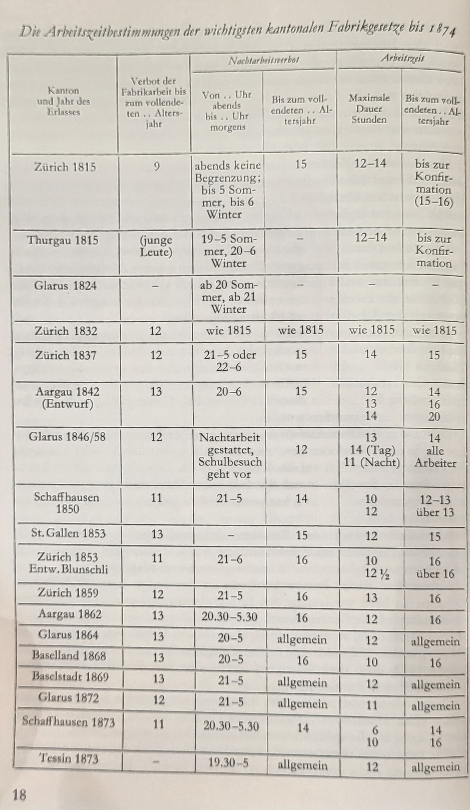

# Forschungsstand

In dieser Arbeit wird sowohl eine soziologische, wie auch technische Herangehensweise gewählt. Dies gilt für die Methodik, die im dritten Kapitel genauer ausgeführt wird, wie auch für die theoretische Fragestellungen. Diese Fragestellung wird in diesem Abschnitt genauer beschrieben. 

Das Thema Arbeitszeitverkürzung rund um den zweiten Weltkrieg und in der Nachkriegszeit wurde schon in einigen Schriften behandelt. In diesem Kapitel wird auf einige dieser Werke eingegangen und es wurde versucht die wichtigen Erkenntnisse zusammenzutragen. Die Werke setzten sich dabei mit der theoretischen Behandlung der Arbeitszeit auseinander. Einerseits ging es dabei um die Wirtschaftliche und rechtliche Frage der Arbeitszeitverkürzung, andererseits um die politischen Verhandlungen zwischen den involvierten Organisationen.^[Der Autor Gallati spricht von den sogenannten *Ordnungsfaktoren* [@gallatiArbeitsfriedeSchweizUnd1976, S.4 ff.]. Damit sind die verschiedenen Organisationen/Institutionen gemeint, die den Arbeitsmarkt regulieren. Dazu gehören die Arbeitnehmer:innen und Arbeitgeber:innnen, meistens in Form eines Verbandes organisiert, und der Staat. Die Parteien die an der Debatte um die Arbeitszeitverkürzung teilnehmen sind, im europäischen Kontext, in den meisten Fällen die gleichen. Dies gilt sowohl für Österreich und Deutschland [@alma99312190105505], Frankreich und Belgien[@RudischhauserSabine2017Ft8D] und England [@gallatiArbeitsfriedeSchweizUnd1976]. Der Organisationsgrad dieser Parteien kann unterschiedlich ausgeprägt sein. So können die Verhandlungen z.B. auf Verbandsebene oder auf Unternehmensebene diskutiert werden. Auch wie stark der Staat involviert ist, kann sich von Land zu Land unterscheiden.]
Seltener miteinbezogen wurde die Kommunikation der Organisationen (mit Ausnahme der Kommunikation des Staates) an die Öffentlichkeit. Die Kommunikation der Organisationen, ausserhalb von Verhandlungen, ist in diesem Kontext weniger oft beachtet worden. Dieses Thema bietet eine weitere interessante Dimension für die Analyse der Arbeitszeitverkürzung in der Schweiz.

Die Verbände der Arbeitnehmer:innen und Arbeitgeber:innen lassen sind unter Organisationssoziologischer Ansichtsweisen von Unternehmen unterscheiden. Es handelt sich um eine spezielle Art von Organisationen, die den Organisationen aus dem dritten Sektor ähnlich kommt [@seibelGibtEsDritten1990]. Eine neuere Klassifikation von Thomas Hoebel teilt die Gewerkschaften und Arbeitgeber:innenverbänden in die Gruppe von *Politischen Organisationen* ein [@hoebelPolitischeOrganisationen2012]. Das Ziel dieser Organisationen ist laut Hoebel politische Entscheidungen für kollektive Probleme zu erreichen oder zu verhindern. Die Organisationen sind auf zukünftige, noch zu treffende Entscheidungen fokussiert und wenden dafür ihre Ressourcen auf. Für Gewerkschaften und Arbeitgeber:innenverbände gibt es dabei zwei weitere Probleme. Sie müssen einerseits durch ihre Aktivität die Mitglieder weiter für sich motivieren können und zusätzlich neue Mitglieder gewinnen können (Mitgliederlogik). Dies ist vor allem bei Gewerkschaften schwieriger, da die Mitglieder durch den Zweck und die politische Aktivität rekrutiert werden müssen. Bei den Arbeitgeber:innenverbänden funktionieren die Mitglieder meist als Geldgeber:innen für die Personen, die dann politische Ergebnisse erreichen. Dies bringt uns zum zweiten Problem, das nicht immer mit der Mitgliederlogik vereinbart werden kann. Die Organisationen müssen durch ihre Entscheidungen positive Folgen auslösen können (Einflusslogik). Weitere Herausforderungen der Organisationen (die typisch für Organisationen aus dem dritten Sektor sind) sind die Probleme der Freiwilligkeit der Mitgliedschaft[@horchPersonalisierungUndAmbivalenz1985; @schimankOrganisationenAkteurkonstellationenKorporative2002], der Professionalisierung [@hwangRationalizationCharityInfluences2009] und von Refinanzierungsproblemen [@zimmerMoneyMakesWorld2014]. Inwieweit diese Probleme auch auf die beiden Verbände zutreffen kann im Rahmen dieser Arbeit nicht abschliessend diskutiert werden. Ein kleiner Kommentar ist aber dennoch möglich. Die Mitgliedschaft bei den Arbeitnehmer:innenverbänden ist je nach Land unterschiedlich. In den 70er Jahren sind die Mitgliedschaften in den Nachbarsländern zwischen 25% (Frankreich) und über 50%(Österreich)[@gallatiArbeitsfriedeSchweizUnd1976, S.161 ff.]. Die Schweiz befindet sich mit ca. 35% im Mittelfeld (S.22). Die Anzahl der Mitglieder wird von Gallati auch als Organisationsgrad bezeichnet. Ein hoher Organisationsgrad bedeutet ein hoher relativer Anteil an Mitgliedern. Zu den Arbeitgeber:innenverbänden gibt es keine vergleichbaren Zahlen. Auch da wird die Relevanz des jeweiligen Verbandes durch die erfassten Arbeitnehmer:innen bestimmt (z.B. S.27). Es dürften somit einge der Probleme der Mitgliedschaft auch bei den Verbänden zu erwarten sein. Zur Professionalisierungstendenz lässt sich auch wieder aus Arbeitnehmer:innensicht ein Kommentar abgeben. Im Beitrag zur Arbeitszeitverkürzung von Peter Kaufmann, geht er auf die Definition der Arbeitszeit ein. An dieser Stelle bemerkt er, dass die Diskussionen rund um die Arbeitszeit immer wie komplexer werden und ohne genügend Freizeit und Erholung nicht mehr von den Arbeitnehmer:innen verfolgt werden können. Es führt zu einem Auseinanderleben der Basis und der "elitären" Führung in den Gewerkschaften [@kaufmannVierzigstundenwocheSchweizAnschaulichtheoretischer1960, S. 76 ff.]. Dies beschreibt eine Professionalisierungstendenz innerhalb der Gewerkschaften. Zur Problem der Refinanzierung gibt es in den Quellen keine Angaben, die auf ein Problem hinweisen würden. Auf Arbeitnehmer:innenseite ist dieses Problem wenn dann aber eher akuter. Durch die starke Institutionalisierung der Gewerkschaften wird eine Grundfinanzierung aber eher unproblematisch sein. ^[Alle Angestellten beim Kanton Solothurn zahlen auch ohne Mitgliedschaft einen Solidaritätsbeitrag von 5 CHF pro Monat an die Gewerkschaft. Dies wird direkt bei der Lohnabrechnung über das Personalamt abgezogen.] Auf Seite der Arbeitgeber:innenverbänden gibt es keinen Grund ein Finanzierungsproblem zu erwarten. Die hohe Solidarität unter den Arbeitgeber:innen zeigte sich unter anderem bei der finanziellen Unterstützung der Gipserbetriebe beim Gipser:innenstreik von 1963 in Zürich. Obwohl der Streik 105 Tage dauerte erhielten die Betriebe genügend finanzielle Mittel um ohne schwerwiegende Folgen aus dem Streik herauszugehen [@alma99312190105505, S. 154 f.]. Die Solidarität unter den Unternehmen wird sich wahrscheinlich auch auf den Verband übertragen lassen. Solange der Verband die wichtigen politischen Ziele erreicht. Zusammenfassend lässt sich somit sagen, dass die Verbände von den Problemen einer drittsektor Organisation nicht ausgeschlossen sind. Inwiefern die Probleme sich genau auswirken müsste jedoch noch untersucht werden.

Als Grundlage für die Analyse werden die Mitgliederzeitschriften des Arbeitnehmer:innenverbandes und des Arbeitgeber:innenverbandes analysiert. Es handelt sich um eine spezielle Art der Kommunkation, die zwar öffentlich war, sich jedoch an Mitglieder gerichtet hat. Durch diese Kommunikation an die Mitglieder wird vor allem eines der oben angesprochenen Probleme bearbeitet. Die Mitglieder werden über die politischen Ziele und Ansichten der Verbände informiert. Dies hilft die Mitglieder weiterhin oder neu für die Verbände zu gewinnen (Freiwilligkeit der Mitgliedschaft). Durch die vermeintliche Professionalisierung der Verbände ist es ausserdem ein wichtiges Mittel, um die beiden Ziele (Mitgliederlogik und Einflusslogik) nicht zu weit auseinanderklaffen zu lassen. Als Informationsmittel können diese Zeitschriften die Personen mit weniger Zeit, über die komplexeren Themen informieren und politisch abholen.
Die Kommunikationssoziologische Frage ist in einem explorativem Forschungskontext zu verorten. Das Ziel ist die explorative Erforschung der Mitgliederkommunikation der beiden Verbände. Dabei steht das Thema der Arbeitszeitverkürzung im Vordergrund. Durch die quantitativ-explorative Forschungsmethode sind Einschätzungen über die komplexen Widersprüche der oben genannten Ziele von politische Organisationen nicht möglich. Dies ist einer präzisen, qualitativen Methode vorbehalten. Die Möglichkeit dieses Forschungsdesigns ist jedoch die Themen und Dimensionen in den Zeitschriften zu erforschen. Ausserdem können die Ähnlichkeiten und Differenzen der beiden Verbände explorativ untersucht werden. Diese Arbeit lässt sich somit als eine Art Vorbereitung für die genauere Analyse der Mitgliederkommunikation von Gewerkschaften und Arbeitgeber:innenverbänden klassifizieren. 

Für die Analyse dieser Texte werden computergestützte Textanalyseverfahren verwendet. `r colorize("MEHR ZU TEXTANALYSEN IN SOZIALWISSENSCHAFTEN", "blue")` (grösste Datenmengen, historische Bedeutung etc.)
Aus technischer Sicht sind für diese Arbeit mehrere Fragestellungen interessant. Einerseits ist die Frage, ob die bisherigen Erkenntnisse aus der Forschungsliteratur mit diesen Methoden reproduzierbar sind. Idealerweise sollten die Erkenntnisse aus den (meist) qualitativen Analysen auch mit den quantitativen Vorgehensweisen erkennbar sein. Andererseits ist die Anwendung von computergestützten Methoden auf dieses empirische Material interessant. Da es sich beim empirischen Material um historische Zeitschriften aus Archivbeständen handelt und nicht um digitale Produkte der Neuzeit. Somit leistet diese Arbeit auch einen Beitrag zur Erforschung der soziologisch-historischen Herangehensweise kombiniert mit Datenwissenschaften. Ein weiterer grosser Zusatzpunkt ist, dass sich diese grosse Menge an Text (40 Jahre Zeitschriften) in einer eher kleinen Masterarbeit bearbeiten lässt. Eine qualitative Betrachtung dieser Menge an Text ist im Rahmen einer Masterarbeit fast unmöglich. 


`r colorize("weitere Mögliche Fragestellungen:","orange")`

* Ist es möglich Erkenntnisse aus der bisherigen Literatur auch mit quantitativen Vorgehen zu erkennen und zu bestätigen?
* Wie verhält sich die Kommunikation rund um das Thema Arbeitszeit bei den beiden Verbänden? Werden ähnliche Themen angesprochen? 
* Ist LDA für die Analyse von Mitgliederzeitschriften ein geeignetes Analysetool 


## Forschungsgegenstand

Für eine klare und strukturierte soziologische Diskussion ist die Definition der Begriffe eine wichtige Grundlage. Auch bei der Diskussion um die Arbeitszeit gilt es im Vornherein die zentralen Begriffe für die Diskussion der Arbeitszeitverkürzung genauer zu beschreiben. Diese Beschreibung der zentralen Begriffe folgt im ersten Teil dieses Kapitels. Anschliessend folgt eine Übersicht über die wichtigen Organisationen und Institutionen, die mit dem Thema der Arbeitszeitverkürzung in der Schweiz stark involviert sind. 

### Arbeitszeit

Für das Wort Arbeitszeitverkürzung gibt es im aktuellen Sprachgebrauch mehrere Alternativen. Die Forschenden Bader et al. nutzen eine solche Alternative. Sie beschreiben in ihrem Working Paper den Begriff Erwerbsarbeitszeit [@baderWenigerIstMehr2020]. Ein anderer Begriff der sich auch auf dieses Verhältnis bezieht ist Lohnarbeit 
[@stogerArbeitszeitverkurzungAlsVoraussetzung2015]. Diese beiden Begriffen grenzen sich vom Begriff der Arbeitszeitverkürzung durch eine Präzisierung ab. Arbeit bezieht sich in diesem Fall ausschliesslich auf ein Lohn- bzw. Erwerbsverhältnis, in dem die menschliche Arbeit für eine (heutzutage meistens) monetäre Entschädigung getauscht wird. Diese Arbeit befindet sich somit in einem wirtschaftlichen Tauschverhältnis. Die Präzisierung macht klar, dass der Begriff der Arbeit somit auch in anderen Bereichen verwendet wird. Einer dieser Bereiche, der in den letzten Jahren immer mehr Aufmerksamkeit erhalten hat, ist die sogenannte Care-Arbeit. `r colorize("Literatur zum Thema Care Arbeit", "blue")`.

Ein weiterer Begriff der, vor allem auch in den Medien, stellvertretend für eine Arbeitszeitverkürzung steht ist die Viertagewoche. Dieser Begriff bezeichnet die Reduktion der Lohn-/Erwerbsarbeitszeit von fünf auf vier Tage. Die Diskussion um die Verkürzung der Arbeitswoche um einen Tag ist schon eine ältere. In den früheren Phasen der Arbeitszeitverkürzung wurde oft von einer Verkürzung zu einer Fünftagewoche gesprochen, da in der Schweiz noch bis Mitte des 20 Jahrhunderts an sechs Tagen pro Woche gearbeitet worden ist. Die Viertagewoche steht auch stellvertretend für den Inhalt der aktuellen Debatte, nämlich der Verkürzung von fünf auf vier Tage Arbeit pro Woche, und präzisiert noch stärker was mit Arbeitszeitverkürzung gemeint ist. Dennoch bleibt ein Problem bei der Verwendung dieses Begriffs. Auch wenn in der Viertagewoche eine Arbeitszeitverkürzung impliziert ist, bedeutet dies nicht automatisch, dass eine Verminderung der Arbeitstage zu einer Arbeitszeitverkürzung führt. Die Viertagewoche kann für die Gestaltung attraktiverer Arbeitsverhältnisse genutzt werden wie ein Beispiel der Firma 25h Hotels zeigt [<https://abouttravel.ch/reisebranche/25hours-hotels-fuehrt-4-tage-arbeitswoche-ein/>]. Das Unternehmen führte im Frühjahr 2022 die Viertagewoche für alle ihre Mitarbeitenden ein. In diesem Modell wird an vier Tagen neun Stunden gearbeitet. Die Differenz zur Vertraglichen Normalarbeitszeit wird wie (Minus)Überstunden gehandhabt. Die Debatte um die Viertagewoche wurde in den 1970er Jahren schon verstärkt in Deutschland, den USA und anderen Ländern in Europa geführt. In Deutschland war der Anlass die Verkürzung der Arbeitswoche auf 35 Arbeitsstunden. Im Buch von Mark W. Rien findet sich eine detailierte Übersicht über die Argumente der Debatte in den 70er Jahren [@rien4TageWoche1972]. Dabei sind die Volkswirtschaftlichen und gesundheitlichen Argumente gleich wie heute oder wie bei der Verkürzung am Anfang des 20. Jahrhunderts (dazu weiter unten mehr). Im Vergleich zur heutigen Debatte sind, zumindest im Beitrag von Rien, keine feministischen und ökologischen Argumente aufgeführt.

Die Zeit die für die Arbeit aufgewendet wird lässt sich weiter in unterschiedliche Phasen oder Teile einteilen, die alle eine gewisse Zeit beanspruchen. Zusätzlich zur Arbeitszeit gibt es die Pausen, die heutzutage üblicherweise in der Arbeitszeit mit eingerechnet werden. `r colorize("QUELLEN", "blue")`. Nebst den Pausen gibt es jedoch auch noch andere "nicht-produktive" Phasen während der Arbeitszeit, die zum Beispiel durch Ermüdung ausgelöst werden. Wie oben im Beispiel vom Unternehmen 25h Hotels gezeigt, werden auch die Überstunden (sowohl plus als auch minus) mit der Arbeitszeit verrechnet. Dies wird vermutlich in einem Jahresarbeitszeitmodell verrechnet. Die Arbeitszeit lässt sich somit in folgende Zeiten unterteilen:

$$Arbeitszeit = produktive Arbeitszeit + Pausen + nicht-produktive Arbeitszeit + Überstunden$$

Als Gegenstück zur Arbeitszeit gibt es die Freizeit, die neben der Arbeitszeit und der Zeit für den Schlaf, den Rest des Tages füllt. Doch auch die Freizeit besteht aus unterschiedlichen Phasen oder Teilen. So schreibt Kaufmann von der Erholungszeit und der tatsächlichen Freizeit. Die Erholungszeit ist die Zeit die der Körper für die physische und psychische Erholung nach der Arbeitszeit braucht. In seiner Analyse aus dem Jahr 1970 berechnete er die Erholungszeit anhand der verbrauchten Kalorien. Er gibt auch einen Hinweis darauf, dass dies für mental fordernde Arbeit schwieriger zu berechnen ist. Jedoch ist die Annahme, dass die Erholungszeit von psychisch fordernder Arbeit höher ist als von rein physischer Arbeit. Die echte Freizeit ist die Zeit, die nach Abzug der Erholungszeit noch zur Verfügung steht. Diese echte oder tatsächliche Freizeit kann ihrerseits wieder mit kultureller Zeit aufgefüllt werden. Diese kulturelle Zeit erfordert jedoch auch psychischer und/oder physischer Anstrengung. Anhand dieser Definitionen lässt sich die echte Freizeit folgendermassen berechnen:

$$echte Freizeit = 24 Stunden - (Arbeitszeit + Erholungszeit + Schlafenszeit)$$

Ein wichtiger Aspekt für die Verhandlung von Arbeitszeitverkürzungen war jeweils auch die Verhandlungen um die Ferien. Diese Verhandlungen waren besonders in der Schweiz ziemlich komplex und verschachtelt und führten zu mehreren kantonalen wie auch nationalen Rechtsgebungen.

Sowohl die Ferien wie auch der Arbeitszeit können in unterschiedlichen Zeiträumen betrachtet werden. Dabei sind es je nach Thema Jahres-, Monats, Wochen- oder Tagesdimensionen, die entscheidend sind. Zu Beginn der Diskussion um Arbeitszeitverkürzung in der Schweiz wurde jeweils die Arbeit pro Tag besprochen. Später fand ein Paradigmenwechsel zur Diskussion um die Wochenarbeitszeit statt (dazu weiter unten mehr). Die Jahresarbeitszeit spielt vor allem in den GAV eine wichtige Rolle, da die meisten Unternehmen mit einem Jahresarbeitszeitmodell arbeiten`r colorize("QUELLE", "red")`. Wichtig für die Diskussion ist die Normierung von Arbeitszeit auf einen bestimmten Zeitraum, da diese Quantifizierung der Arbeit es ermöglicht Vergleiche und Analysen durchzuführen [@espelandSociologyQuantification2008].

Nebst den Verhandlungen um die Arbeitszeit sind auch stets Lohnverhandlungen geführt worden. Die Analyse und Diskussion um Lohnverhandlungen kann an diesem Punkt jedoch nicht aufgenommen werden, da sie zu komplex ist und einer eigenen Analyse bedarf. `r colorize("eventuell ein Hinweis auf ein Werk, das sich mit Lohnverhandlungen in der Schweiz beschäftigt", "orange")` Dennoch gibt es einen Begriff der in der Debatte um Arbeitszeitverkürzungen eine zentrale Rolle spielt. Der volle Lohnausgleich bedeutet, dass für die neue (tiefere) Arbeitszeit immer noch derselbe Lohn bezahlt wird. Nebst dem vollen Lohnausgleich gibt es auch einen Teil-Lohnausgleich. Wie bei den Ferien und Überstunden werden die meisten Arbeitszeitverkürzungskompromisse zusammen mit Lohnausgleichen verhandelt. 


### Arbeitszeitverkürzung

Im Anbetracht der weiter oben geführten Diskussion um die Definition der Arbeitszeit, ist es sinnvoll genauer zu beschreiben, wie in dieser Forschungsarbeit Arbeitszeitverkürzung definiert wird. Als Arbeitszeitsverkürzung wurden alle Regelungen berücksichtigt, die eine tiefere **Wochenarbeitszeit** und mindestens zum Teil einen Lohnausgleich beinhaltet haben. Ausserdem sind vor allem die Regelungen interessant, die zu einer nationalen oder branchenübergreifenden Arbeitszeitregelung führten. Durch diese Definition ist es möglich die Entwicklung in der gesamten Schweiz zu betrachten, statt sich in der Entwicklung einer Branche zu verlieren.

### Arbeitsrecht in der Schweiz

Die Gesetzgebung in der Schweiz betreffend des Arbeitsrechts besteht aus vier verschiedenen Grundpfeilern. Erstens ist sie durch die Bundesverfassung geregelt. Hier sind insbesondere der Artikel 110 (Rechtliche Erlaubnis Vorschriften zum Thema Arbeit zu erlassen), Art. 122 (Regelung Zivilrecht), Art. 28 (Koalitionsfreiheit) und der Artikel 8 Ziff. 3 (Gleichstellung von Mann und Frau [!sic]) zu erwähnen.^[Weitere Artikel sind Art. 11 Ziff. 1 (Schutz von Jugendlichen und Kindern), Art. 22 (Versammlungsfreiheit), Art. 23 (Vereinigungsfreiheit) und Art. 27 (Wirtschaftsfreiheit)] Der zweite Einfluss auf das Arbeitsrecht ist der Einzelarbeitsvertrag, der vor allem durch die OR Artikel 319-355 definiert wird. Drittens gibt es das Recht des Gesamtarbeitsvertrages (OR Artikel 356 bis 358). Als vierte und letzte Gesetzgebung gibt es das Bundesgesetz über die Arbeit in Industrie, Gewerbe und Handel (Arbeitsgesetz oder ArG). Wie oben bereits erwähnt ist der Fokus dieser Arbeit auf der Frage rund um nationale oder branchenübergreifenden Bestimmungen zur Arbeitszeit. Eine Bestimmung zur Arbeitszeit findet sich nur in einer dieser verschiedenen Rechtsgrundlagen und zwar im Arbeitsgesetz (ArG). Die anderen Gesetze dienen als Grundlagen für die Rechte und Pflichten der Vertragsteilnehmenden und für die Rechte und Pflichten des Bundes. Ausserdem werden grundlegende ideologischen Grundlagen für die Arbeitszeitverhandlungen definiert (z.B. Art. 28 Ziff. 3 Streik). Im nächsten Abschnitt wird aus diesem Grund vor allem die Entwicklung bis hin zum Arbeitsgesetz, das 1964 in Kraft getreten ist, beschrieben. Wo nötig werden weiter Anpassung der Rechtsgrundlagen (z.B. der Verfassung) vermerkt. 

### Entwicklung bis zum Arbeitsgesetz

Einen ausführlichen Überblick über die Entwicklung der Arbeitszeitregulierungen bis zu den 1960er Jahren liefert die Dissertation von Kaufmann. Anlässlich der Diskussionen um die Vierzigstundenwoche schreibt Kaufmann über die Geschichte der Arbeitszeitverkürzungen in der Schweiz. Im ersten Teil widmet er sich dabei der Arbeitszeitgesetzgebung[@kaufmannVierzigstundenwocheSchweizAnschaulichtheoretischer1960, S. 7-76] . Vor dem Jahr 1874 war es dem Bund rechtlich nicht erlaubt die Arbeitszeit gesetzlich zu regeln. Die Gesetzgebung in diesem Bereich war in der Hoheit der Kantone. Viele dieser Gesetze waren vor allem auf den Schutz der jugendlichen Fabrikmitarbeitenden und Kindern gerichtet. 
Für einen Überblick der wichtigsten Arbeitszeitbestimmungen in den Kantonen siehe folgende Abbildung: 


Nach der Verfassungrevision von 1874 war es auch dem Bund möglich Gesetze über die Arbeitszeitregelung zu erlassen. Dies geschah dann mit dem eidgenössischen Farbikgesetz von 1877 zum ersten Mal. In diesem Gesetz wurden für alle Mitarbeitenden in Fabriken der Elfstundentag eingeführt. An Tagen vor Sonntagen betrug die Arbeitszeit zehn Stunden. Ausserdem müssen die Arbeiten am Tag zwischen 6 bis 20 Uhr verrichtet werden. Ausnahmen können, mit Einwilligung der Arbeitnehmer:innen, für männliche Jugendliche (!sic) und erwachsene Personen genehmigt werden. Umgerechnet in eine normale (fünf Arbeitstage + einen Samstag) Wochenarbeitszeit wären dies *65 Stunden* Arbeit pro Woche. Die nächste gesetzliche Arbeitszeitverkürung von grösserer Bedeutung wurde nach dem Landesstreik von 1918 erlassen. In der Zwischenzeit gabe es eine Änderung an der Samstagsarbeitszeit. Neu durfe nur noch neun Stunden und bis 17 Uhr gearbeitet werden. Dieses Gesetz wurde auch Samstaggesetzlein genannt. Auch wenn 1914 eine Revision des Fabrikgesetztes vom Bundesrat verabschiedet worden war, wurde die Bestimmungen aus diesem Gesetz aufgrund des 1. Weltkrieges kaum angewendet. So war der darin gesetzte Zehnstundentag auch 1918 noch nicht umgesetzt. Bevor also diese Gesetzesvorgaben überhaupt umgesetzt worden waren, führten die internationalen und schweizerischen Gewerkschaftskämpfe zu einer weiteren Anpassung. Die Revision von 1914 wurde 1919 mit einer Novelle ergänzt und wurde trat 1920 in Kraft. Diese Novelle stellte gleichzeiteig auch einen Paradigmenwechsel dar. Neu wurde die Arbeitszeit nicht mehr auf den Tag, sondern auf die Woche normiert. Die Novelle schreibt eine Arbeitszeit von 48 Stunden pro Woche vor. Wie viel an den verschiedenen Tagen gearbeitet wird, kann beliebig festgelegt werden, solange die Arbeit zwischen 5 und 20 Uhr verrichtet wird. In Ausnahmefällen konnten Arbeitszeiten von 52 Stunden pro Woche beantragt und genehmigt werden. Diese Arbeitszeitregulierung blieb bis zum Arbeitszeitgesetzt 1964 die einzige eidgenössische Regelung. Die Arbeitszeiten wurden in den Zwischenjahren weiterhin angepasst, jedoch war dies auf Grundlage von Kollektivverträgen zwischen Arbeitnehmerorganisationen und Arbeitgeberverbänden.  

Nebst der Entwicklung in Fabriken geht Kaufmann auch auf die Regelungen vom Gewerbe, Transportanstalten und dem Bundespersonal ein. Dem Bund war es auch mit der Revision von 1874 nicht möglich für andere Bereiche ausser den Fabriken eidgenössische Gesetze zu erlassen. Die erste nationale Regelung im Gewerbe ist 1922 in Kraft getreten. Ausschlaggebend war der Anschluss der Schweiz an die Internationalen Übereinkommen der Internationalen Arbeitskonferenz von Washington. Diese Übereinkommen regelten das Mindestalter im Gewerbe, sowie die Nachtarbeit und den Schutz vor Bleivergiftung für Frauen(!sic) und Jugendliche. Da dies für Fabrikarbeitende schon gesetzlich gereglet war musste für das Gewerbe eine Sonderregelung eingeführt werden. Obwohl ein nationales Gesetz eingeführt worden war, wurde die Arbeitszeit für das Gewerbe nicht eidgenössisch geregelt. In den 1920er Jahren wurde die 48-Stundenwoche in einigen Kantonen eingeführt, aber es gab bis zum Arbeitsgesetz keine einheitliche Regelung der Arbeitszeit für das Gewerbe (Ausnahmen gab es in einigen Branchen wie zum Beispiel das internationale Übereinkommen für Arbeitsbedingungen von Rheinschiffer(!sic) von 1954). <br>
Für die Transportanstalten trat im Jahr 1873 ein *Bundesgesetz über den Bau und Betrieb von Eisenbahnen in Kraft*. In diesem Gesetz war die Arbeitszeit noch nicht geregelt, jedoch waren die Anzahl Freitage geregelt. Die Anzahl Freitage wurden mit jeder Anpassung der Arbeitszeit auch angepasst. Im Jahr 1956 waren gesetzlich 60 Ruhetage pro Jahr festgeschrieben. Die erste Arbeitszeitregulierung war 1890 in Kraft. Das *Bundesgesetz betreffend Arbeitszeit beim Betriebe der Eisenbahnen und anderer Transportanstalten* regelte die normale tägliche Arbeitszeit auf 12 Stunden (72 Stunden pro Woche). Dieses Bundesgesetz wurde in den Jahren 1902 (11 Stunden pro Tag = 66-Stundenwoche) und 1920 (8 Stunden pro Tag = 48-Stundenwoche) überarbeitet. Bis zum Arbeitsgesetz wurden lediglich 1948 und 1956 noch einige Veränderungen an den Ferien- und Ruhetagen vorgenommen. <br>
Für das Bundespersonal wurde 1927 eine Bundesgesetz festgelegt. Die Arbeitszeit wurde auf 45.5 Stunden festgelegt. 

In der Schweiz gab es somit bis zum Arbeitsgesetz von 1964 keine eidgenössische Gesetzgebung, die auf alle Arbeitnehmenden zugetroffen hat. Dieses Arbeitsgesetz stellt aber auch in der aktuellen Zeit die einzige nationale Rechtsgebung für die Arbeitszeit dar. Das Gesetz hat ausserdem seit der Einführung auch kaum Anpassungen (im Bereich Arbeitszeit) erhalten. Die normale Wochenarbeitszeit wurde bei der Einführung auf 46 Stunden pro Woche für Arbeitnehmer *"in industriellen Betrieben sowie für Büropersonal, technische und andere Angestellte, mit Einschluss des Verkaufspersonals in Grossbetrieben des Detailhandels"* (Art. 9 Ziff. 1 Lit. a) festgelegt. Für alle übrigen Arbeitnehmer war die wöchentliche Höchstarbeitszeit auf 50 Stunden (Art. 9 Ziff.1 Lit. b) festgelegt. In einer Klausel wurde es dem Bundesrat ermöglicht bei passenden wirtschaftlichen Verhältnissen, *"...insbesondere die Lage auf dem Arbeitsmarkt, und der Grad der Überfremdung..."* (Schweizerisches Bundesarchiv), den Artikel 9.1a anzupassen. Diese Reduktion der Arbeitszeit von 46 auf 45 Stunden erfolgte in einer Berichtigung von 1975.  

Wie bereits erwähnt ist der einzige Ort im Schweizer Recht, an dem die Arbeitszeit geregelt ist, das Arbeitsgesetz. Weitere Möglichkeiten zur Bestimmung von Arbeitsstunden sind in den Gesamtarbeitsverträgen zu finden. Eine Übersicht über diese Gesamtarbeitsverträge findet sich weiter unten. 

### Die Ordnungskräfte in der Schweiz

Auf Arbeitnehmerseite gibt es viele unterschiedliche Verbände, die teilweise zusammengeschlossen und teilweise unabhängig voneinander sind. Eine der wichtigsten Dachorganisationen ist der Schweizerische Gewerkschaftsbund (SGB). Viele der wichtigsten Gewerkschaftsverbände sind Teil des SGB. Nach dem 2. Weltkrieg waren dies unter anderem (alle Namen nur im generischen Maskulin) der Schweizerische Metall- und Uhrenarbeiterverband (SMUV) oder der Schweizerische Textil- und Fabrikarbeiterverband (STFV). Aber auch der Schweizerische Verband des Personals öffentlicher Dienste (VPOD), der heutzutage zu den grössten Gewerkschaften zählt, ist Teil des SGB. Speziell zu erwähnen ist ausserdem noch, dass die meisten Mitglieder des Föderativverbandes des Personals öffentlicher Verwaltung und Betriebe (rund 100'000 Mitglieder), auch Mitglieder eines Verbandes innerhalb des SGB sind. Der SGB ist Mitgliedermässig der grösste Bund von Arbeitnehmenden. Nicht nur durch die Grösse sondern auch durch die politische Haltung ist der SGB die wichtigste Arbeitnehmer:innen-Organisation in der Frage der Arbeitszeitverkürzung. 

Nebst dem SGB gibt es noch weitere Verbunde, die sich nicht nur der Arbeiter:innenbewegung anschlossen, sondern sich ideologisch auch noch anders positionierten. Diese von Wüthrich bezeichneten Minderheitsgewerkschaften sind der Christlich-Nationale Gewerkschaftsbund (CNG), der Schweizerische Verband Evangelischer Arbeiter und Angestellter und der Landesverband freier Schweizer Arbeiter (LFSA, liberale Weltanschauung). 
Der letzte unabhängige Verband ist die Vereinigung Schweizerischer Angestelltenverbände (VSA), welche die Angestellten der Privatwirtschaft unter sich vereinigt. 

Die Zusammenarbeit zwischen den Minderheitsgewerkschaften, dem VSA und dem SGB ist kaum vorhanden [@hardmeierAusGeschichteSchweizerischen1970]. Der SGB ist ausserdem fast der einzige Gewerkschaftsbund, der in der politischen Diskussion rund um die Arbeitszeitverkürzung aktiv war. Auch der CNG war noch ein bisschen involviert, die andere Bunde jedoch kaum oder gar nicht [@alma99312190105505, S.6].

Die Arbeitgeber:innen sind in vier Dachverbänden organisiert: Schweizerischer Handels- und Industrieverein (SHIV), Zentralverband schweizerischer Arbeitgeber-Organisationen (ZSAO), Schweizerischer Gewerbeverband (SGV) und dem Schweizerischen Bauernverband (SBV). Der wichtigste Verband für die politische Stellung der Arbeitgeber:innen zur Arbeitszeitverkürzung war der ZSAO, der in den 1920er Jahren praktisch als Gegenbewegung zur Arbeitnehmer:innenbewegung gegründet wurde. Der Bauernverband ist in der Frage der Arbeitszeit als Arbeitgeberverband kaum wichtig. Der Austausch zwischen der Arbeitgeber:innenverbänden ist viel ausgeprägter als auf der Arbeitnehmer:innen-Seite. Im Gegensatz dazu setzten sich die drei Verbände ZSAO, SHIV und SGV für die wichtigen Entscheidungen zusammen. Viele der Mitglieder in einem Verband sind auch in anderen Verbänden Mitglieder. Und auch auf der Führungsstufe ist die Koordination durch gegenseitige Vertretung gesichert [@alma99312190105505, S.7 ff.].


### Gesamtarbeitsverträge

Die Regelung der Arbeitszeit, sowie andere Arbeitsschutzmassnahmen, können durch einen Gesamtarbeitsvertrag (GAV) weiter spezifiziert werden. Das ARG ist lediglich der Mindestschutz, der für alle Arbeitnehmenden eingehalten werden muss. Der GAV wird durch die berechtigten Verhandlungsparteien ausgehandelt und unterschrieben. Sowohl der SGB wie auch der ZSAO sind jedoch nicht in der Lage Gesamtarbeitsverträge unterschreiben zu können. Die GAV können nur von Arbeitgeber:innen, deren direkten Verbände und von Arbeitnehmer:innenverbänden unterschrieben werden^[wie bereits erwähnt finden sich die Bestimmungen zum GAV in OR Art. 356 - 358]. Der SGB und der ZSAO sind beides Verbände aus Verbänden und haben dadurch keine rechtliche Grundlage die GAV zu unterschreiben. Sie wirken somit als Koordinationsstelle und Austausch für die jeweiligen Vertragsparteien. Es gibt verschiedenen GAV mit unterschiedlichen Wirkungsgebieten. Gallati bezeichnet für seine Arbeit fünf unterschiedliche GAV:

* Firmenverträge, die das Verhältnis innerhalb eines Unternehmens regeln
* Ortsverträge, die das Verhältnis innerhalb einer Gemeinde regeln ^[Der Verband evanglischer Arbeiter und Angestellter (!sic) ist nach Ortsprinzip organisiert. Wahrscheinlich unterzeichnet der SVEA somit die meisten dieser Verträge. Andere Möglichkeiten sind GAV für Gemeindsmitarbeitende]
* Kantonalverträge
* Landesteilverträge
* Landesverträge ^[Die meisten Personen werden von Landesverträge erfasst. Diese Verträge sind vor allem verbreitet in Branchen die gut organisiert sind und in der ganzen Schweiz vertreten sind [@gallatiArbeitsfriedeSchweizUnd1976, S.80 f.]]


Bis zu den 1920er Jahren war der GAV auf beiden Seiten nicht beliebt. Für die Arbeitgeber:innen war die Verhandlung eine Privatsache und nicht kollektiv machbar. Die Arbeitnehmer:innen befürchteten einen Stillstand durch kollektive Verhandlungen. Mit der Änderung der Rechtlage und der Integration des GAV in das OR im Jahr 1911 war zumindest der rechtliche Pfeiler gestellt. Es dauerte aber trotzdem noch einige Jahre bis sich der GAV als Arbeitszeitregulation durchsetzten konnte. Ab den 30er Jahren bis zum heutigen Tag ist der GAV das wichtigste Mittel zur kollektiven Festsetzung der Arbeitszeit[@gallatiArbeitsfriedeSchweizUnd1976, S.74 ff.].


## Der Charakter der gesetzlichen Arbeitszeitverkürzung in der Schweiz

Der Autor Wüthrich schreibt in seiner Dissertation von einem *"schweizerischen, arbeitszeitpolitischen Stil"*, der vor allem durch ein starke Disziplin im Arbeitsverhältnis und Berücksichtigung der volkswirtschaftlichen Lage definiert wird [@alma99312190105505, S.195 ff.]. Grundsätzlich ist die Einstellung zur Arbeitszeitreduktion eher zurückhaltend. In der Diskussion zur Einführung des Arbeitszeitgesetzes kommt dies gut zum vorschein. So sind die Arbeitgeber klar der Meinung, dass ein bundesweites Gesetz die Arbeitszeit nicht heruntersetzen dürfe. Obwohl ein Gesetz eine Grundlage zur Debatte stellen könnte, muss ein Spielraum zwischen Gesetz und Vertrag bestehen bleiben. Das Gesetz darf auf keinen Fall die Einzel- und Gesamtarbeitsverträge aushöhlen. Der Bundesrat hat sich einige Jahre zuvor, bei der Landesringinitative zur 44-Stundenwoche, auch noch Argumente der Arbeitnehmer:innen berücksichtigt. So sollte das Gesetz eine Sicherung des bereits Erreichten darstellen und an Orten, die hinter der allgemeinen Entwicklung sind, einen besseren Standard setzten. In der Diskussion zum Arbeitsgesetz schliesste er sich aber dann vollkommen den Argumente der Arbeitgeber:innen an (S.92 ff.). Dieser Wechsel zu einer konservativeren Haltung lässt sich dann auch aus dem Arbeitsgesetz rauslesen. Denn die öffentlich rechtliche Festlegung der Arbeitszeit im Arbeitsgesetz von 1964 führte zu keinen wesentlichen Verbesserungen der Arbeitsbedingungen. Bei der Einführung des ArG war die durchschnittliche Arbeitszeit in der Industrie bei 44.8 Stunden (Botschaft des Bundesrat 1966, S.379). Dennoch ist anzunehmen, dass doch einige Personen von einer Arbeitszeitreduktion profiteren konnten. Immerhin wurden mit dem neuen Gesetz zusätzlich 800'000 Arbeiter:innen einer gesetzlichen Arbeitszeitregulierung unterstellt. Von den 1.8 Millionen Arbeiter:innen waren demnach "nur" eine Million Teil eines GAV's. 

Als zusätzliche Bemerkung lässt sich sagen, dass die Arbeitszeitentwicklung in der Schweiz nicht immer konservativ geprägt war. Zu seiner Zeit war das Glarner Fabrikpolizeigesetz von 1864, welches auch als Grundlage des eidgenössichen Fabrikgesetzes von 1877 diente, eines der fortschrittlichsten seiner Zeit (auch international) war [@kaufmannVierzigstundenwocheSchweizAnschaulichtheoretischer1960, S.16]. Auch bei den Anpassungen des eidgenössischen Fabrikgesetzes nach dem Landesstreik von 1918 wurde eine progressive Reduktion der Arbeitszeit gesetzlich festgeschrieben. Von diesem progressiven Stil haben sich die Verhandlungsparteien dann aber immer weiter gelöst. Auch heutzutage sind die Wochenarbeitszeiten sowohl im ArG, wie auch in den GAV auf einem sehr hohen Niveau und gehören europäisch zu den höchsten.


### Bedeutung des Arbeitsfriedens für die Schweiz

Der Arbeitsfriede ist ein Wort, das in den von Wüthrich geschildereten Diskussionen immer wieder fällt. Nebst der offensichtlichen Bedeutung für die politische Debatte, ist es ausserdem eine spezielle Eigenschaft der Arbeitrechtsverhandlungen, die es in dieser Form sonst in anderen Ländern nicht gibt. Der Arbeitsfriede ist für alle beteiligten Parteien ein wichtiges Prinzip, das es einzuhalten gilt. Aus diesen Gründen ist es sinnvoll an dieser Stelle genauer auf das Konzept des Arbeitsfrieden einzugehen.

Rechtlich ist der Arbeitsfrieden im OR. Art. 357a Ziff 2. geregelt:

>*"Jede Vertragspartei ist verpflichtet, den Arbeitsfrieden zu wahren und sich insbesondere jeder Kampfmassnahme zu enthalten, soweit es sich um Gegenstände handelt, die im Gesamtarbeitsvertrag geregelt sind; die Friedenspflicht gilt nur unbeschränkt, wenn dies ausdrücklich bestimmt ist."* 

Der Autor Gallati unterscheidet aufgrund dieser Regelung zwei unterschiedliche Arten des Arbeitsfriedens. Einerseits die relative Friendspflicht, bei der die jeweiligen GAV Bestimmungen eingehalten werden. Dabei gibt es die negative Seite der Friedenspflich, bei der beide Parteien verboten wird die Bestimmungen aufzulösen oder Gewalt anzuwenden um dies zu forcieren. Als positive Seite der Ausübung der Friendspflicht bezeichnet Gallati die Pflicht die einzelnen Mitglieder auch von Gewalt abzuhalten (auch Einwirkungspflicht genannt). Hier sind die Lücken der relativen Friendspflicht gut erkennbar. Sie gelten nur für die Vertragsparteien des GAV und für die in den GAV bestimmten Gewaltaktionen. Alles was nicht explizit in den GAV vermerkt ist kann nicht als Friendensbruch interpretiert werden. So sind zum Beispiel Sympathie- oder Solidaritätsaktionen nicht ausgeschlossen. Auch Proteste von einzelnen Gruppen (und nicht von den Verbänden) können nicht zwingend als Friedensbruch angesehen werden. Bei der absoluten Friendspflicht sind diese Einschränkungen nicht mehr gültig. Die absolute Friendspflicht muss in den GAV ausdrücklich erwähnt werden, aber bezieht sich dann sowohl auf alle Aktionen, wie auch auf alle Personen, Gruppen und Verbände[@gallatiArbeitsfriedeSchweizUnd1976, S.102 ff.]. 

Ein wichtiger Punkt in der Entwicklung des Arbeitsfriedens war das sogenannte Friedensabkommen von 1937. In diesem Jahr schlossen die Arbeitnehmer:innenverbände der Metallindustrie (unter anderem der Schweizerische Metall- und Uhrenarbeiterverband SMUV) und der Arbeitgeberverband schweizerischer Maschinen- und Metallindustrieller (!sic) ASM zusammen einen speziellen GAV ab. In diesem GAV wurde nur die absolute Friedenspflicht geregelt, alle anderen Themen wurden später in zusätzlichen Verträgen gereglet. Die Besonderheit dieses Ereignisses war vor allem, dass die beiden Verbände in der Vergangenheit eher verfeindet waren. Grund für dieses plötzliche Übereinkommen war die geplante Einmischung des Bundes bei der Bestimmung der Löhne. Dieser Wechsel von freiwilliger Schlichtung des Staates zu einer Zwangsschlichtung wurde von beiden Seiten nicht geduldet. Eine Möglichkeit den Bund an diesem Plan zu hindern, war gemeinsam ein Abkommen abzuschliessen. Dieses Abkommen war ein Wendepunkt im Sozialpartnerverhältnis[@gallatiArbeitsfriedeSchweizUnd1976, S.111 ff.].  In den nachfolgenden Jahren mussten waren die Verhandlungen für die Verlängerung öfters zäh. Trotzdem wurde das Friedensabkommen immer wieder erneuert. Die Auswirkungen des Abkommens sind mannigfaltig und auf alle einzugehen sprengt den Rahmen dieser Arbeit. Die Arbeitszeitdiskussionen sind lediglich ein Teil der Verhandlungen. Dennoch ist das Friedensabkommen ein sehr grosser Teil des Verhandlungscharakters und bestimmt wie diese Verhandlungen geführt werden. Gallati schreibt von sechs Verabredungen in den Jahren 1949 bis 1975, in der die Arbeitszeit für die Metallbranche neu geregelt wird. Nebst der Arbeitszeit wurde unter anderem auch Kinderzulagen, Lohn, Ferien und vieles andere aufgrund des Friedensabkommens neu geregelt (S.125). Auch in anderen Branchen wurde das Friedensabkommen in diesen Jahren mehr und mehr angewandt.

Eine Auswirkung des Arbeitsfriedens sind die friedlichen Verhandlungen und somit das Ausbleiben von Arbeitskämpfen. Als Arbeitskämpfen werden Streiks (Arbeitnehmer:innen) oder Arbeitsausschlüsse (Arbeitgeber:innen) definiert. Die folgende Tabelle ist aus der Publikation von Gallati (S.155): 

```{r Arbeitskämpfe in der Schweiz 1922 bis 1971}
Streik <- read.csv("E:/R Projects/Daten_MA//Masterarbeit/data/Streik_1922_1971.csv")

Streik <- as.data.frame(Streik)

kbl(Streik, caption = "Arbeitskämpfe in der Schweiz 1922 bis 1971", booktabs = T) %>% 
  kable_styling(latex_options = c("scale_down", "hold_position"))

```

In einem weiteren Teil des Buches beschreibt Gallati die Arbeitsmarktstrategien von umliegenden Ländern. Dabei unterscheidet er zwischen zwei unterschiedlichen Typen. In Österreich und Deutschland sind es eher friedlichen Arbeitsmarktstrategien, die der Schweiz ähnlich sind. Keines der beiden Ländern kennt jedoch den expliziten Arbeitsfrieden. Der andere Typ sind Länder, in denen Arbeitskämpfe stark verbreitet sind. Gallati beschreibt in diesem Typ die Länder Frankreich und England. Da die Publikation von Gallati aus den 70er Jahren ist, werden hier die Entwicklung seit dieser Zeit dargestellt. Wichtig zu beachten sind die Skalen auf der Y-Achse die je nach Land unterschiedliche Grössen haben. Bei den "verlorenen" Arbeitstagen [@iloDaysNotWorked2019] ist gut zu sehen, dass in den deutschsprachigen Ländern weniger Arbeitstage betroffen sind.

```{r Tage nicht gearbeitet preparation, include=FALSE}
days_not_worked <- read.csv("E:/R Projects/Daten_MA//Masterarbeit/data/days_not_worked.csv")

df_days_not_worked  <- days_not_worked  %>% rename(country = ï..ref_area.label) %>% 
  select(country,time,obs_value,classif1.label) %>%
  filter(classif1.label == "Economic activity (Broad sector): Total") %>% 
  rename(days = obs_value) %>% mutate(days_in_th = days/1000)


```

```{r, fig.cap= "Tage nicht gearbeitet"}

ggplot(df_days_not_worked, aes(x = time, y = days_in_th)) + 
  geom_line()+ facet_grid(rows = vars(country), scales = "free_y") + ylab("Tage in Tausend") + xlab("Jahr") + theme_bw() + labs( caption = "International Labour Organization 2019")
```


```{r Involvierte Arbeitende setup}

workers_involved <- read.csv("E:/R Projects/Daten_MA//Masterarbeit/data/workers_inv.csv")

df_workers_involved  <- workers_involved  %>% rename(country = ï..ref_area.label) %>% 
  select(country,time,obs_value,classif1.label) %>%
  filter(classif1.label == "Economic activity (Broad sector): Total") %>% rename(workers_in_th = obs_value) %>% 
  mutate(workers = workers_in_th*1000)


```

```{r, fig.cap= "Beteiligte Arbeitnehmer:innen"}
ggplot(df_workers_involved, aes(x = time, y = workers_in_th)) + 
  geom_line() + facet_grid(rows = vars(country), scales = "free_y") + ylab("Arbeitnehmer:innen in Tausend") +
  xlab("Jahr") + theme_bw() + labs(caption = "International Labour Organization 2019")
```

Aber auch bei Frankreich und vor allem England ist ein Rückgang seit den 70er Jahren zu verzeichnen. Bei den betroffenen Arbeitnehmer:innen [@iloWorkersInvolvedStrikes2019] sind in Frankreich und England auch wieder ein Trend zum Rückgang zu verzeichnen. In Deutschland sind eher weniger Personen betroffen. In der Schweiz und Österreich sind, mit Ausnahmen von jeweils einem Peak, kaum Leute betroffen. Interessanterweise scheint es in der Schweiz in den 10er Jahren des 21. Jahrhunderts ausserordentlich viele Arbeitnehmer:innen zu betreffen. Dies lässt sich zumindest als ein Indiz für die Aktualität der Verhandlungen von Arbeitsbedingungen interpretieren.


### Der Einfluss der Volkswirtschaftlichen Lage

Wie bereits erwähnt ist ein wichtiger Teil des Schweizerischen Arbeitszeitpolitischen Stils die starke Rücksicht auf die volkswirtschaftliche Lage des Landes. Es macht Sinn an dieser Stelle genauer auf dieses Themen einzugehen. 

In einer Analyse zu den wirtschaftlichen Folgen und Voraussetzungen einer Arbeitszeitverkürzung schreibt der Autor Michaelis auch über die geeignete Konjunkturphase. Dabei kommt er zu folgendem Schluss:

>*"Unter Berücksichtigung der Tatsache, dass von den durch eine Arbeitszeitverkürzung beeinflussbaren Grössen der Beschäftigungsgrad, das Produktionsvolumen sowie die Höhe der Lohnsätze, der Unternehmergewinne und der Realeinkommen die wichtigsten sind, scheinen die Voraussetzung für eine Arbeitszeitverkürzung am günstigsten, wenn und solange der Beschäftigungsgrad relativ gross ist, jedoch noch keine Vollbeschäftigung herrscht. Ob dieser Zustand im Verlaufe eines Aufstieges oder Niedergangs erreicht wird oder ob er vielleicht den Höhepunkt eines Konjunkturzyklus darstellt, ist weniger wichtig"*
>
> `r tufte::quote_footer("---[@alma997904240105505, S. 87]")`

Die Konjunkturphase ist somit nicht die einzige Dimension, die es zu beachten gilt. Da in den politischen Debatten und den Verhandlungen zwischen den Verbänden vor allem auf die Konjunktur eingegangen worden ist, macht es sinn den Einfluss der Phasen genauer anzuschauen. Denn auch Michaelis gibt Hinweise darauf welche Phasen weniger oder besser geeignet sind. Generell lässt sich sagen, dass eine Arbeitszeitverkürzung vor allem bei einer Veränderung der Konjunktur, also einem Aufschwung oder Niedergang, am besten geeignet ist. Bei einem Aufschwung ist der Wille die Produktivitätseinbussen durch Investitionen auszugleichen am höchsten. Nicht nur sind die finanziellen Möglichkeitenö gegeben, zusätzlich ist es auch politisch das beste Klima für eine Arbeitszeitreduktion. In einem Niedergang wäre das politische Klima zwar weniger geeignet, dafür wäre es die beste Ausgangslage aus finanzieller Sicht. Umso kürzer der Höhepunkt der Konjunktur zurückliegt, desto mehr Kapital haben die Unternehmen um die Arbeitszeitreduktion ausgleichen zu können. In diese Phasen der Veränderung wäre es somit theoretisch am geeignesten Arbeitszeitreduktionen zu veranlassen. Im Gegensatz dazu sind die Depression und die Hochkonjunktur nicht geeignet, um die Arbeitszeit zu verkürzen. In einer Depression sind die finanziellen Mittel sowohl für Löhne wie auch Investitionen nicht hoch genug. Einerseits besteht somit keinen hohen Anspruch an eine Arbeitszeitverkürzung, da die finanzielle Lage der Arbeitnehmer:innen zuerst gesichert werden muss. Andererseits können durch fehlende Mittel und Nachfrage keine Änderung in der Produktivität erzeugt werden. In einer Hochkonjunktur ist das grösste Problem die Vollbeschäftigung von Arbeiter:innen. Da alle Personen arbeiten aber die Nachfrage immer noch stark vorhanden ist kann nicht genügen produziert werden, um die Nachfrage zu decken. Eine Arbeitszeitverkürzung würde diese Tendenzen noch verstärken. Dies resultiert dann entweder in Überstunden (damit die Produktion erhöht wird) oder einer Zunahme der Preise (damit nicht mehr soviel konsumiert werden kann). Somit wären auch Arbeitnehmer:innen negativ von einer Arbeitszeitreduktion betroffen [@alma997904240105505, S. 79-90]. 

Die Analyse von Michaelis ist aus einer betriebs- und volkswirtschaftlichen Perspektive. Viele der theoretischen Annahmen gründen somit in der Lehre der Wirtschaftswissenschaften. Gerade aus soziologischer Perspektive ist es aber notwendig diese Annahmen auch zu hinterfragen. Ein gutes Beispiel zum Grund für die Hinterfragung von wirtschaftlichen Theorien findet sich einem Beitrag von Mirowski und Nik-Kha zur Radiofrequenzversteigerung in den USA [@mirowskiMarketsMadeFlesh2007]. Generell ist die ganze Forschung rund um die Performativität von Wirtschaftstheorien [siehe zum Beispiel @callonLawsMarkets1998a; @mackenzieEconomistsMakeMarkets2007a] ein guter Anlass um Annahmen der Wirtschaftstheorie auch kritisch zu beleuchten. Bezogen auf die Analyse von Michaelis gibt es dabei vor allem zwei Punkte, die es zu hinterfragen gibt. Ersten geht der Autor davon aus, dass mit einer Arbeitszeitverkürzung ein Prdouktionsrückgang verbunden ist. Dass dies nicht immer so ist zeigt unter anderem das Experiment der Arbeitszeitverkürzung in Island [@haraldssonGoingPublicIceland2021]. In diesem Beitrag zeigen die Autoren Haraldsson und Kellam auf, dass die Verkürzung der Arbeitszeit vor allem mit einer Reorganisation verbunden ist. Bestehende Strukturen werden verändert und optimiert, sodass dieselbe Arbeit in weniger Zeit erledigt werden kann. Einen grossen Punkt der sich zeigte war vor allem das Einsparen oder Verkürzen von Meetings. Dieses Experiment wurde in einem spezifischen nationalen Kontext und "nur" mit Staatsangestellten durchgeführt. Daher sind die Ergebnisse nicht zwingend auf alle anderen Staaten oder auf die Privatwirtschaft übertragbar. Dennoch sollten diese Ergebnisse nicht einfach ignoriert werden. Denn auch theoretische Abhandlungen des Themas aus eher sozialwissenschaftlichen Perspektive zeigen, dass mit Arbeitszeitreduktion nicht unbedingt eine Einbusse an Produktivtät verbunden sein muss [Siehe dazu @baderWenigerIstMehr2020; @stogerArbeitszeitverkurzungAlsVoraussetzung2015]. Zweitens geht Michaelis von der Annahme aus, dass Lohnverhandlungen den Arbeitszeitsverhandlungen zuvor kommen und erst wenn der Lohn auf der "gerechtfertigten" Höhe ist, wird überhaupt über die Arbeitszeit diskutiert. Wie bereits beschrieben lassen sich diese Themen aber nicht so einfach voneinander lösen. In der Dissertation von Wüthrich wird klar, dass diese Verhandlung rund um die Themen Lohn, Arbeitszeit und Ferien parallel und gleichzeitig verlaufen. Ein weiteres Beispiel, das der Annahme von Michaelis widerspricht, ist in der Dissertation von Kaufmann aufzufinden. Kaufmann schreibt von einer *bewussten Mehrarbeitspolitik*, die das Ziel hat durch Arbeitszeitreduktion den Lohn zu erhöhen. Die Reduktion der Arbeitszeit wird dann zu einem Mittel zur Lohnpolitik [@kaufmannVierzigstundenwocheSchweizAnschaulichtheoretischer1960, S. 65f.]. Die Ansprüche rund um den Lohn und die Arbeitszeit lassen sich somit nicht in eine Reihenfolge einteilen. Beide Bedürfnisse können je nach Voraussetzung von der Arbeitnehmer:innenseite gefordert und unterschiedlich gewichtet werden. 

### Fremdarbeiter:innen

Die Fragen rund um die Volkswirtschaft und die Konjunkturlage hat den Diskurs im Parlament, dem Bundesrat, Arbeitgeber:innenverbänden und Arbeitnehmer:innenverbänden stark geprägt [siehe Kapitel 3 @alma99312190105505]. Nebst diesen wirtschaftstheoretischen Fragen war ein weiteres Thema von bedeutender Wichtigkeit. Der Umgang mit Fremdarbeiter:innen aus dem Ausland beschäftigt nicht nur die Verbände, sondern den gesamten politischen Apparat und das Schweizer Volk.

Ein Merkmal der Hochkonjunktur in der Nachkriegszeit war die Vollbeschäftigung der Arbeitnehmer:innen. Doch auch mit einer Vollbeschäftigung war es immer noch nicht möglich der Nachfrage im In- und Ausland nachzukommen. Da die Unternehmen weiterhin investierten und zusätzliche Produktionsanlagen oder Standorte gebaut haben, mussten diese irgendwie mit Personal besetzt werden. Die Lösung war Arbeitnehmer:innen (vor allem italienische Arbeitnehmer) aus dem Ausland in der Schweiz anzustellen. Diese Anstellungen sind in den 50er und 60er Jahren immer wie weiter gestiegen. Im Jahr 1964 hat die Anzahl der Fremdarbeiter:innen 721'000 erreicht und machte damit über einen Drittel aller Erwerbstätigen aus [@alma99312190105505, S. 156]. Die Anstellungsverhältnisse für diese Arbeitnehmer:innen waren generell ziemlich schlecht. So war es zum Beispiel nur mit einer Bewilligung möglich den Beruf zu wechseln. Da viele der einheimischen Arbeitnehmer:innen die Phase ausnutzen konnten um in einen anderen (Wunsch)Beruf zu wechseln ^[Durch die Vollbeschäftigung waren überall immer wieder Leute gesucht um Stellen zu besetzten. Im Gegensatz zu schlechtere Konjunkturphasen war also eine Arbeitnehmer:innen Knappheit auf dem Arbeitsmarkt. Dies sorgte dafür, dass die Verhandlungsmacht der Arbeitnehmer:innen grösser war als zu anderen Zeiten. Viele Personen nutzten dies um aus den Jobs in der Industrie in Gewerbe oder Bürojobs zu wechseln[@riedoProblemAuslaendischenArbeitskraefte1976].], war dies den ausländischen Arbeitstätigen nicht möglich. Des weiteren war es der Familie der Fremdarbeiter:innen nicht erlaubt in die Schweiz nachzuziehen. Dies war erst möglich nach einer gesetzlich festgelegten Frist, die zu Beginn drei Jahre dauerte. Nach einer Reise des italienischen Arbeitministers Sullo Anfangs der 60er Jahre, forderte er eine bessere Behandlung der Fremdarbeiter:innen in der Schweiz. In seiner Reise durch die Schweiz hat er die schlechte Lebens- und Arbeitsbedingungen der italienischen Arbeitnehmer:innen gesehen und kritisierte diese aufs schärfste. Der Bundesrat hat anschliessend ein Abkommen ausgehandelt in dem wirtschaftliche und soziale Besserstellungen der Fremdarbeiter:innen veranlasst werden. Ausserdem wurde die Nachzügelfrist von 36 auf 18 Monate verkürzt [@alma99312190105505, S. 157 f.]. Im Buch von Wüthrich und in den von ihm zitierten Quellen wird auf diesen Zustand oft das Wort Überfremdung angewendet. Dieser Zustand führte immer wieder zur Kritik aus unterschiedlichen Richtungen. Es geht sogar soweit, dass der Autor Riedo dies als eine innenpolitische Krise der Schweiz beschreibt [@riedoProblemAuslaendischenArbeitskraefte1976]. Riede beschreibt zwei sozialpolitische Probleme, die durch die Fremdarbeiter:innenbeschäftigung ausgelöst oder verstärkt worden sind. Eines dieser Probleme die Wohnknappheit, die schon vor dem erhöhten Zuzug von Fremdarbeiter:innen ein Problem war. Das andere Problem bezieht sich auf die Lohnverhandlungen zwischen Arbeitgeber:innen und Arbeitnehmer:innen. Von den Seiten der Arbeitgeber:innen wurden vor allem die Vorschriften des Staates kritisiert. Durch die innenpolitischen Probleme der hohen Fremdarbeiter:innenzahlen wurde vom Bundesrat verlangt, diese Zahlen nicht weiter zu erhöhen. Dies machte er in der Anfangsphase durch eine Auferlegung eines Kontingents. Es war der ganzen Wirtschaft nicht gestattet mehr als eine bestimmte Anzahl Fremdarbeiter:innen in einem Jahr anzustellen. Eine weitere Massnahme war zum Beispiel ein Baubeschluss von 1964, wo der Bau von bestimmten Gebäuden (vor allem Vergnügungsanlagen) nicht mehr gestattet war. Dies hatte vor allem die Absicht den Wachstum und die Investition zu stoppen. Zur selben Zeit wurde auch ein Kreditbeschluss verfasst, der zum Ziel hatte den Geldzufluss aus dem Ausland zu stoppen. Dies führte zu heftigen Prosteten auf der Seite von der Arbeitgeber:innen und wurde als Einschnitt in die Wirtschaftsfreiheit betrachtet [@alma99312190105505, S. 157 ff.]. Auch auf Seite der Arbeitnehmer:innen gab es Unzufriedenheit mit dem hohen Fremdarbeiter:innenbestand. Sowohl bei den Lohn- und Wohnungspolitischen Diskussionen wurde kritisiert, dass die Übermässigen Einnahmen der guten Konjunkturphase ausschliesslich für den weiteren Ausbau der Gewinne der Unternehmer:innen eingesetzt wurde. Es wurde kaum oder zu wenig in den Sozialapparat oder öffentliche Ausgaben investiert. Ausserdem wurde den Arbeitgeber:innen vorgeworfen, dass sie für die ausländischen Arbeiter:innen ausserordenliche Dinge machten, die sie für die schweizerischen Arbeitnehmer:innen nicht machen würden. Obwohl dies nicht immer tatsächlich so war, wurde dieses Gefühl der Benachteiligung durch die Arbeiter:innenschaft an den SGB herangetragen. Es wurde verlangt, die Anzahl der Fremdarbeiter:innen zu beschränken. Dem SGB war bewusst, dass die Schweiz mit der bisher strikten Regelung zum Familiennachzug hinter dem europäischen Standard war und erwartete 1960 eine Anpassung dieser Regelung in der Zukunft. Deshalb war es für den SGB wichtig, dass nicht zu viele Fremdarbeiter:innen mehr angestellt werden. Das frühere Nachzügeln würde die Wohnungsknappheit noch mehr verschärfen. In der Lohnpolitik wird von Seiten der Arbeitnehmer:innen vor allem das Problem von Tieflohninseln kritisiert. Da viele Fremdarbeiter:innen den Lohn nicht verhandeln können oder die Lohnvorstellung von z.B. Italien haben, wurden viele mit tiefen Löhnen angestellt. Dies führte dazu, dass sich sozial rückständige Unternehmen und Branchen nur dank diesem Zuzug am Leben halten konnten. Ausserdem führte es generell eher zu einem Stillstand der Löhne als zu einer Entwicklung[@riedoProblemAuslaendischenArbeitskraefte1976, S.97 ff.].
Ein speziellen Kritikpunkt gibt es an dieser Stelle noch zu erwähnen, da es sich explizit auf die Dimension der Arbeitszeit bezieht und nicht auf Lohn- oder Wohnungspolitische Probleme. Dabei geht es um die Kompensation der Arbeitszeit vor Weihnachten. Da viele der Famillien der italienischen Erwärbstätigen nicht in die Schweiz kommen durften, wollte ein grosser Teil zurück nach Italien. Da die Transportmittel der Bahnen dies aber nur in mehreren Wochen bewältigen konnten, verliessen schon viele vorher den Arbeitsplatz. Der Ausgleich der Arbeitszeit war gesetzlich gestattet. Das Problem war jedoch, dass auch viele inländische Arbeitnehmer:innen diese Arbeitszeit vorholen mussten und auf die Fünftagewoche für einige Monate verzichten mussten. Sie kritisierten deshalb die Arbeitgeber:innen und waren der Meinung, dass der Produktionsausfall von dennen getragen werden soll, der übermässig investiert hat und die hohe Anzahl Fremdarbeiter:innen zu verschulden hat. Stattdessen waren es die Arbeitnehmer:innen die für diese übermässigen Investitionen aufkommen mussten. 


In den letzten Abschnitten wurden die wichtigsten Dimensionen der Frage rund um die Arbeitszeitverkürzung zwischen 1930 bis 1970 beschrieben. Es ist wichtig zu beachten, dass diese Dimensionen eine Synthese der unterschiedlichen Forschungsliteratur ist. Es sind somit nicht alle Dimensionen abgebildet, aber die wichtigsten. Auch wenn sich das empirische Material dieser Arbeit von den anderen Arbeiten unterscheidet, kann davon ausgegangen werden, dass diese Dimensionen auch sichtbar sein werden. Genauer gesagt wird erwartet, dass die Themen rund um die Begriffe **Arbeitsfrieden, Fremdarbeiter:innen und Konjunkturlage** in den Zeitschriften behandelt werden. 